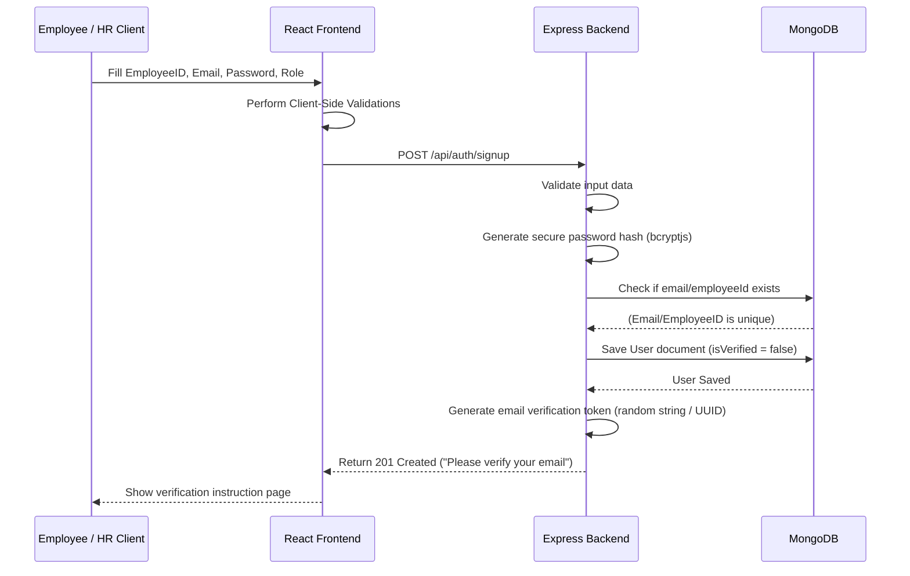
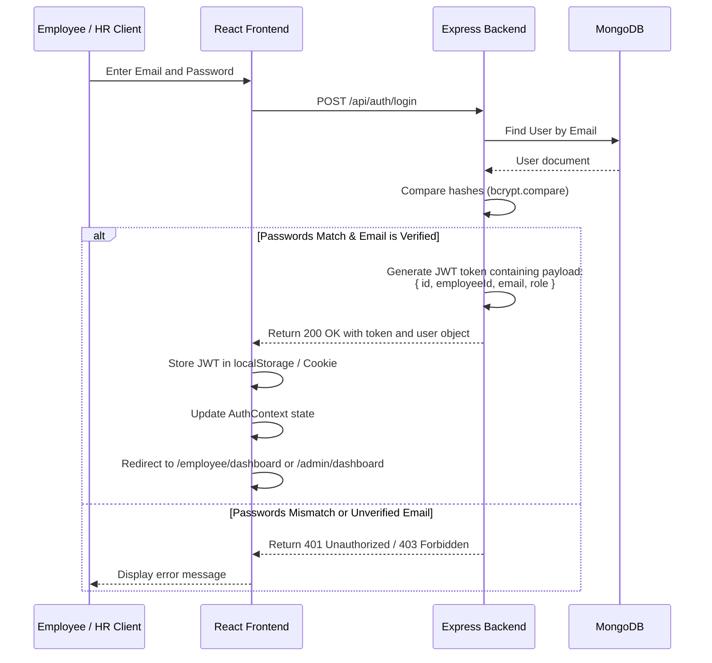

# Authentication Flow - Dayflow HRMS

This document outlines the authentication and authorization flow implemented in Dayflow HRMS, covering both frontend client interactions and backend validation steps.

---

## 1. Sign Up Flow



---

## 2. Sign In Flow



---

## 3. Route Access Authorization Flow

Whenever an authorized client requests a resource:

1. **Authorization Header**: The client sends the JWT token in the request header:
   ```http
   Authorization: Bearer <token>
   ```
2. **Backend Authentication Middleware (`requireAuth`)**:
   - Extracts the token from the header.
   - Decodes and verifies the signature using the server's `JWT_SECRET`.
   - Attaches decoded data (`req.user = { id, employeeId, email, role }`) to the request object.
   - If invalid or expired, returns `401 Unauthorized`.
3. **Backend Role Authorization Middleware (`requireRole`)**:
   - Inspects `req.user.role`.
   - Checks if the role is allowed to access the route (e.g. requires `ADMIN` or `HR`).
   - If not authorized, returns `403 Forbidden`.
4. **Backend Ownership Verification Middleware (`requireOwnership`)**:
   - Used for resource-level actions (e.g., retrieving profile, deleting document).
   - Validates that the requested employee record resource ID matches the `req.user.id` or that the requester is `ADMIN`/`HR`.
   - If mismatch, returns `403 Forbidden`.
5. **Frontend Guards**:
   - `ProtectedRoute.jsx` checks `AuthContext` to ensure the user is logged in before rendering dashboard pages.
   - `RoleRoute.jsx` checks user role against permitted roles for the target route, redirecting unauthorized users back to their respective dashboards.
