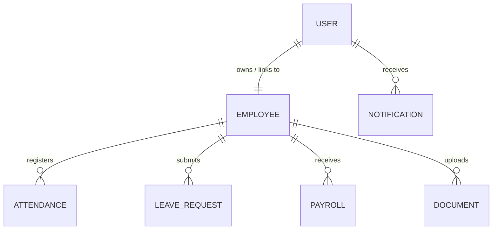

# Database Schema - Dayflow HRMS

This document outlines the MongoDB schema design for the Dayflow HRMS. It uses Mongoose models for data modeling.

---

## 1. Entity-Relationship Diagram (Conceptual)

---

## 2. Collections & Field Specifications

### 2.1 User
The `users` collection contains login credentials and system configuration boundaries.

| Field Name | Data Type | Constraints | Description |
| :--- | :--- | :--- | :--- |
| `_id` | ObjectId | Auto-generated | Primary Key |
| `employeeId` | String | Required, Unique, Indexed | Unique HR-assigned identifier (e.g. EMP1001) |
| `email` | String | Required, Unique, Lowercase | User email address |
| `password` | String | Required | Secure bcrypt-hashed password |
| `role` | String | Required, Enum | Role validation: `EMPLOYEE`, `HR`, `ADMIN` |
| `isVerified` | Boolean | Default: `false` | Email verification status |
| `createdAt` | Date | Timestamp | Automatic Mongoose timestamp |
| `updatedAt` | Date | Timestamp | Automatic Mongoose timestamp |

### 2.2 Employee
The `employees` collection stores personal, contact, and structural job information.

| Field Name | Data Type | Constraints | Description |
| :--- | :--- | :--- | :--- |
| `_id` | ObjectId | Auto-generated | Primary Key |
| `userId` | ObjectId | Required, Ref: `User`, Indexed | Relation link to the User collection |
| `firstName` | String | Required | Employee first name |
| `lastName` | String | Required | Employee last name |
| `phone` | String | Required | Contact number (Editable by Employee & Admin) |
| `address` | String | Required | Address details (Editable by Employee & Admin) |
| `profilePicture`| String | Optional | URL of profile image (Editable by Employee & Admin)|
| `designation` | String | Required | Job title (Editable by Admin only) |
| `department` | String | Required | Department title (Editable by Admin only) |
| `joiningDate` | Date | Required | Employment start date (Editable by Admin only) |
| `status` | String | Required, Enum | Employment status: `ACTIVE`, `INACTIVE` (Admin only) |
| `createdAt` | Date | Timestamp | Automatic Mongoose timestamp |
| `updatedAt` | Date | Timestamp | Automatic Mongoose timestamp |

### 2.3 Attendance
Tracks clock-in/out instances and calculates status.

| Field Name | Data Type | Constraints | Description |
| :--- | :--- | :--- | :--- |
| `_id` | ObjectId | Auto-generated | Primary Key |
| `employeeId` | ObjectId | Required, Ref: `Employee`, Indexed | Relation link to Employee |
| `date` | Date | Required, Indexed | Date of attendance (YYYY-MM-DD) |
| `checkIn` | Date | Required | Check-in timestamp |
| `checkOut` | Date | Optional | Check-out timestamp |
| `status` | String | Required, Enum | Status: `PRESENT`, `ABSENT`, `HALF_DAY`, `LEAVE` |
| `createdAt` | Date | Timestamp | Automatic Mongoose timestamp |
| `updatedAt` | Date | Timestamp | Automatic Mongoose timestamp |

*Composite Index*: Unique index on `{ employeeId: 1, date: 1 }` to prevent duplicate daily check-ins.

### 2.4 LeaveRequest
Tracks employee leave requests and approvals.

| Field Name | Data Type | Constraints | Description |
| :--- | :--- | :--- | :--- |
| `_id` | ObjectId | Auto-generated | Primary Key |
| `employeeId` | ObjectId | Required, Ref: `Employee`, Indexed | Relation link to Employee |
| `leaveType` | String | Required, Enum | `PAID`, `SICK`, `UNPAID` |
| `startDate` | Date | Required | Start date of leave |
| `endDate` | Date | Required | End date of leave |
| `remarks` | String | Required | Employee request reasons |
| `status` | String | Required, Enum | `PENDING`, `APPROVED`, `REJECTED` |
| `adminComments`| String | Optional | HR or Admin approval notes |
| `approvedBy` | ObjectId | Optional, Ref: `User` | Admin user ID who reviewed the request |
| `createdAt` | Date | Timestamp | Automatic Mongoose timestamp |
| `updatedAt` | Date | Timestamp | Automatic Mongoose timestamp |

### 2.5 Payroll
Stores salary parameters. Read-only for employees, manageable by Admins.

| Field Name | Data Type | Constraints | Description |
| :--- | :--- | :--- | :--- |
| `_id` | ObjectId | Auto-generated | Primary Key |
| `employeeId` | ObjectId | Required, Ref: `Employee`, Indexed | Relation link to Employee |
| `basicSalary` | Number | Required | Base monthly salary |
| `allowances` | Number | Required, Default: 0 | Medical, transport allowances, etc. |
| `deductions` | Number | Required, Default: 0 | Taxes, leave deductions, insurance, etc. |
| `netSalary` | Number | Required | Final payout: `(basicSalary + allowances) - deductions` |
| `payPeriod` | String | Required | E.g., "August 2026" |
| `createdAt` | Date | Timestamp | Automatic Mongoose timestamp |
| `updatedAt` | Date | Timestamp | Automatic Mongoose timestamp |

### 2.6 Document
Handles files uploaded by employees or shared by HR.

| Field Name | Data Type | Constraints | Description |
| :--- | :--- | :--- | :--- |
| `_id` | ObjectId | Auto-generated | Primary Key |
| `employeeId` | ObjectId | Required, Ref: `Employee`, Indexed | Relation link to Employee |
| `fileName` | String | Required | Display name of the file |
| `fileUrl` | String | Required | URL to file storage (local or cloud) |
| `fileType` | String | Required | E.g. "pdf", "jpg", "png" |
| `createdAt` | Date | Timestamp | Automatic Mongoose timestamp |

### 2.7 Notification
User notification alerts.

| Field Name | Data Type | Constraints | Description |
| :--- | :--- | :--- | :--- |
| `_id` | ObjectId | Auto-generated | Primary Key |
| `userId` | ObjectId | Required, Ref: `User`, Indexed | Recipient user link |
| `title` | String | Required | Alert title |
| `message` | String | Required | Detailed description |
| `isRead` | Boolean | Required, Default: `false` | Read status |
| `createdAt` | Date | Timestamp | Automatic Mongoose timestamp |
