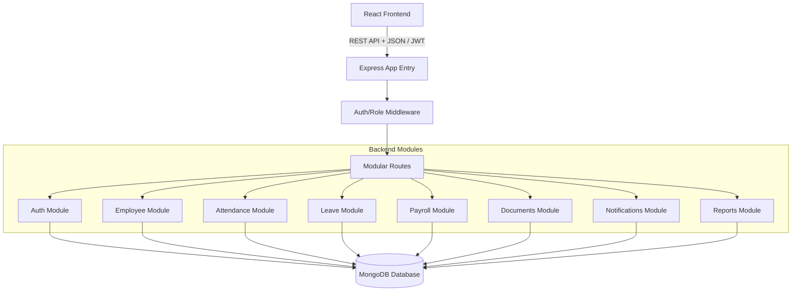

# System Architecture - Dayflow HRMS

## 1. System Overview
Dayflow HRMS is built using a modular monorepo structure. It comprises a decoupled frontend client, a REST API backend, and a database layer. This structure ensures clean segregation of responsibilities and enables developers to work in parallel on isolated folders (modules/features) without blocking each other.

---

## 2. Technology Stack
- **Frontend**: React (Vite-powered SPA), JavaScript/TypeScript, React Router DOM for routing, Axios for HTTP requests, Tailwind CSS for modern, atomic styling.
- **Backend**: Node.js with Express.js framework, structured with custom middlewares (Authentication, Role validation, Error handling, and Request schema validation).
- **Database**: MongoDB using Mongoose ORM for schema definitions and document validation.
- **Authentication**: Stateless JWT (JSON Web Tokens) passed in standard HTTP headers (`Authorization: Bearer <token>`). Passwords hashed securely using bcryptjs.

---

## 3. Component Boundaries

### 3.1 Frontend Features (`frontend/src/features/`)
Each functional area is self-contained. It contains:
- `pages/`: Page-level React components hooked directly to React Router.
- `components/`: Pure visual or interactive elements specific to that feature (e.g., Leave Request Form inside the `leave` feature).
- `services/`: Axios wrappers for communication with corresponding backend modules.
- `hooks/`: Custom hooks managing states or operations unique to the feature.

### 3.2 Backend Modules (`backend/src/modules/`)
Each backend module is cohesive and owns its data structures:
- `*.model.js`: Mongoose database schema definitions.
- `*.controller.js`: Route handlers that interface with services and manage HTTP responses.
- `*.service.js`: Reusable business logic (e.g., database queries, calculations).
- `*.routes.js`: Defines HTTP endpoints, linking middlewares and controllers.
- `*.validation.js`: Local input validation logic (e.g., regex/schema checks).

---

## 4. Deployment Flow
- The monorepo can be containerized using the root `docker-compose.yml` for local development.
- In production, the React frontend is compiled to static files (`dist/`) and served via a CDN or web server (e.g., Nginx), while the Express backend runs in an isolated Node container connecting to a managed MongoDB Atlas instance.
