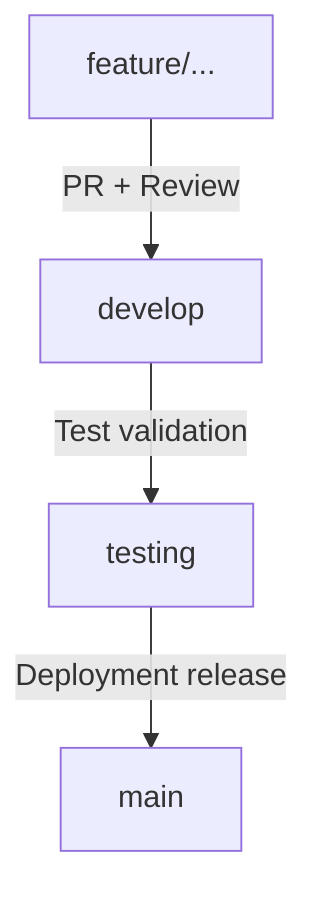

# Git Branching Strategy - Dayflow HRMS

To prevent integration issues and organize code transitions from sandbox to production, our team follows a strict branch-based development model.

---

## 1. Branch Hierarchy



### 1.1 `main`
- **Purpose**: Stable production code.
- **Rules**: Never push code directly to `main`. Changes arrive only via approved Pull Requests from the `testing` or `develop` branch.

### 1.2 `develop`
- **Purpose**: Integrates completed feature branches.
- **Rules**: Serves as the primary source branch for starting new features. Always keep your local `develop` updated.

### 1.3 `testing`
- **Purpose**: Sandbox / QA builds for deployment testing.
- **Rules**: Updated via mergers from `develop` when we are ready for a sprint demo.

### 1.4 Feature Branches (`feature/...`)
- **Purpose**: Individual developer isolation.
- **Naming format**: `feature/<module-name>` (e.g. `feature/auth-employee`, `feature/attendance`).

---

## 2. Developer Workflow Example

Follow these steps for any new task:

1. **Synchronize Local Repositories**:
   ```bash
   git checkout develop
   git pull origin develop
   ```

2. **Create Feature Branch**:
   ```bash
   git checkout -b feature/auth-employee
   ```

3. **Develop & Commit**:
   Keep commits modular and logical, using Conventional Commit prefixes:
   ```bash
   git add .
   git commit -m "feat(auth): scaffold login routes and authentication middleware"
   ```

4. **Prepare for Integration**:
   Before creating a PR, pull the latest develop and merge it into your feature branch to handle conflicts:
   ```bash
   git checkout develop
   git pull origin develop
   git checkout feature/auth-employee
   git merge develop
   # Resolve any merge conflicts locally
   ```

5. **Push and Create Pull Request**:
   ```bash
   git push origin feature/auth-employee
   ```
   Open a Pull Request on GitHub targeting `develop`. Assign team members for review.
